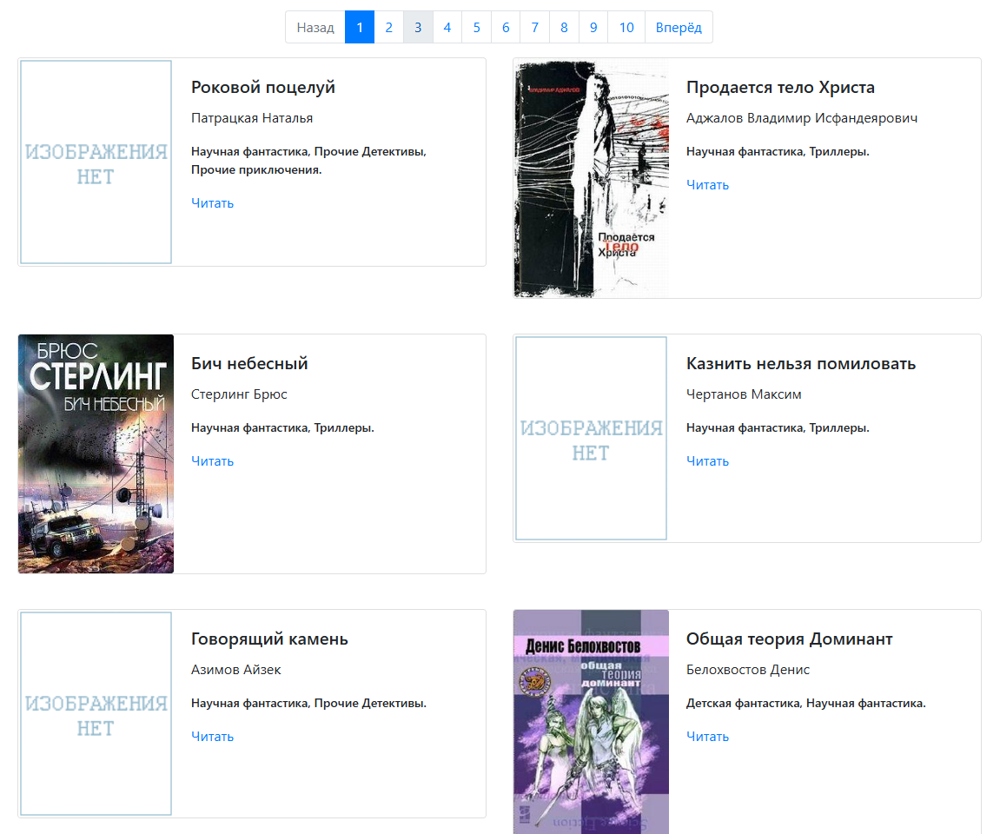
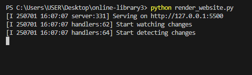

# Онлайн библотека

## Описание
Программа загружает заранее подготовленные книги  и формирует из предоставленной информации сайт.




## Запуск

- Установите Python 3
- Скачайте код
- Установите зависимости командой 
```python
pip install -r requirements.txt
```

## Переменные окружения

```
META_DATA = meta_data.json - Файл хранит все данные о книгах (путь к изображениям, авторов, заголовки, тексты книг)
```
## Примеры запуска

Чтобы запустить сайт, вам необходимо запустить файл render_website.py.
```python
python render_website.py
```
Вы увидите сообщение из консоли, что сайт запущен и готов к работе.



После этого вы можете перейти на [локальную](http://127.0.0.1:5500/pages/index-1.html) версию сайта.

Также есть GitHub-версия сайта, которая запускается по этой [ссылке](https://dilexi.github.io/online-library3/pages/index-1.html). 

## Оффлайн версия сайта

Чтобы запустить оффлайн версию сайта, вам нужно открыть папку с программой(Online-library3), перейти в папку pages и открыть файл index-1.html.

## Цели проекта

Код написан в учебных целях — это урок в курсе по Python и веб-разработке на сайте [Devman](https://dvmn.org).
